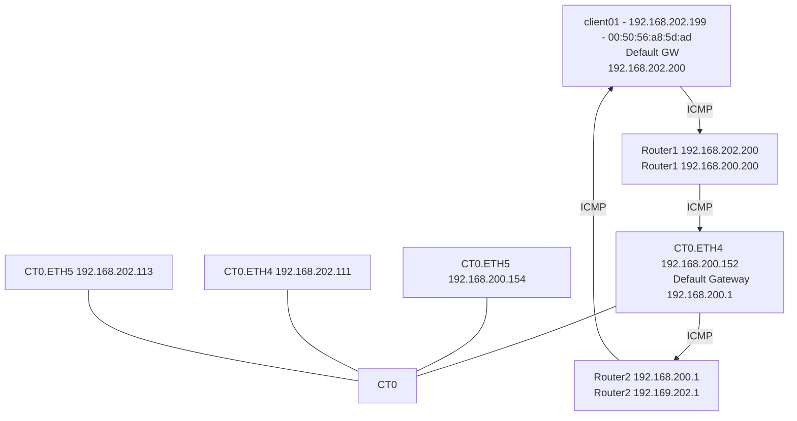

# Test3 - ICMP Diff Router diff subnet

# Results

This test shows that each interface has it's own unique routing table.  Even though there are interfaces directly on the target subnet 202.x for the reply, the outbound packet leaves the interface it arrived on based on it's route table. 

## How? 
[Multiple routing tables in linux](https://unix.stackexchange.com/questions/4420/reply-on-same-interface-as-incoming)