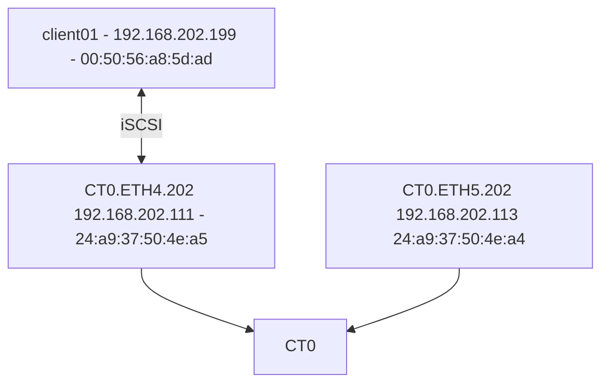

# Test1 - Local subnet iSCSI


# Results
This shows the return path is same as incoming traffic as desired.
Even though we have multiple IPs on the same subnet.

Logs
```
iscsiadm -m node -p 192.168.202.111:3260 -l
Logging in to [iface: iscsi0, target: iqn.2010-06.com.purestorage:flasharray.7776c5951f8da9b8, portal: 192.168.202.111,3260]
Login to [iface: iscsi0, target: iqn.2010-06.com.purestorage:flasharray.7776c5951f8da9b8, portal: 192.168.202.111,3260] successful.

On FA-CT0

eth4: flags=4163<UP,BROADCAST,RUNNING,MULTICAST>  mtu 1500
        inet 192.168.200.151  netmask 255.255.254.0  broadcast 192.168.201.255
        ether 24:a9:37:50:4e:a5  txqueuelen 1000  (Ethernet)
        RX packets 1882416  bytes 143596131 (143.5 MB)
        RX errors 0  dropped 0  overruns 0  frame 0
        TX packets 869148  bytes 161275117 (161.2 MB)
        TX errors 0  dropped 0 overruns 0  carrier 0  collisions 0
        device interrupt 73  memory 0xfb000000-fb01ffff  

eth5: flags=4163<UP,BROADCAST,RUNNING,MULTICAST>  mtu 1500
        inet 192.168.200.152  netmask 255.255.254.0  broadcast 192.168.201.255
        ether 24:a9:37:50:4e:a4  txqueuelen 1000  (Ethernet)
        RX packets 1797872  bytes 135595565 (135.5 MB)
        RX errors 0  dropped 0  overruns 0  frame 0
        TX packets 778685  bytes 134188696 (134.1 MB)
        TX errors 0  dropped 0 overruns 0  carrier 0  collisions 0
        device interrupt 64  memory 0xfb020000-fb03ffff  

#Client
dd if=/dev/zero of=/dev/sdb count=100 bs=1M

After:
eth4: flags=4163<UP,BROADCAST,RUNNING,MULTICAST>  mtu 1500
        inet 192.168.200.151  netmask 255.255.254.0  broadcast 192.168.201.255
        ether 24:a9:37:50:4e:a5  txqueuelen 1000  (Ethernet)
        RX packets 1956832  bytes 253987370 (253.9 MB)
        RX errors 0  dropped 0  overruns 0  frame 0
        TX packets 873610  bytes 162704901 (162.7 MB)
        TX errors 0  dropped 0 overruns 0  carrier 0  collisions 0
        device interrupt 73  memory 0xfb000000-fb01ffff  

eth5: flags=4163<UP,BROADCAST,RUNNING,MULTICAST>  mtu 1500
        inet 192.168.200.152  netmask 255.255.254.0  broadcast 192.168.201.255
        ether 24:a9:37:50:4e:a4  txqueuelen 1000  (Ethernet)
        RX packets 1797996  bytes 135605148 (135.6 MB)
        RX errors 0  dropped 0  overruns 0  frame 0
        TX packets 778733  bytes 134196948 (134.1 MB)
        TX errors 0  dropped 0 overruns 0  carrier 0  collisions 0
        device interrupt 64  memory 0xfb020000-fb03ffff

#dd if=/dev/sdb of=/dev/null count=100 bs=1M

eth4: flags=4163<UP,BROADCAST,RUNNING,MULTICAST>  mtu 1500
        inet 192.168.200.151  netmask 255.255.254.0  broadcast 192.168.201.255
        ether 24:a9:37:50:4e:a5  txqueuelen 1000  (Ethernet)
        RX packets 1963304  bytes 254468006 (254.4 MB)
        RX errors 0  dropped 0  overruns 0  frame 0
        TX packets 953922  bytes 284020842 (284.0 MB)
        TX errors 0  dropped 0 overruns 0  carrier 0  collisions 0
        device interrupt 73  memory 0xfb000000-fb01ffff  

eth5: flags=4163<UP,BROADCAST,RUNNING,MULTICAST>  mtu 1500
        inet 192.168.200.152  netmask 255.255.254.0  broadcast 192.168.201.255
        ether 24:a9:37:50:4e:a4  txqueuelen 1000  (Ethernet)
        RX packets 1798137  bytes 135615168 (135.6 MB)
        RX errors 0  dropped 0  overruns 0  frame 0
        TX packets 778801  bytes 134208727 (134.2 MB)
        TX errors 0  dropped 0 overruns 0  carrier 0  collisions 0
        device interrupt 64  memory 0xfb020000-fb03ffff  


# All Tests:

```
puresupport@MUCFA22-ct0:~$ purearray list --controller
Name  Type              Mode       Model     Version  Status  Current Mode Since        Internal Details
CT0   array_controller  primary    FA-X70R3  6.6.9    ready   2024-07-12 14:49:28 CEST  
CT1   array_controller  secondary  FA-X70R3  6.6.9    ready   2024-07-12 14:58:04 CEST
```
