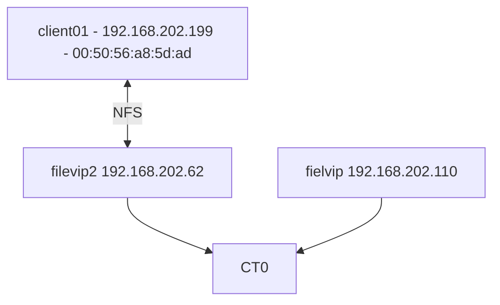

# Test1 - Local subnet iSCSI

```mermaid
flowchart TD
  A[client01 - 192.168.202.199 - 00:50:56:a8:5d:ad] <-- NFS --> B1[filevip2 192.168.202.62]
  B1 --> C[CT0]
  B2[fielvip 192.168.202.110] --> C[CT0]

```
# Results
This shows the return path is same as incoming traffic as desired.
Even though we have multiple IPs on the same subnet.

