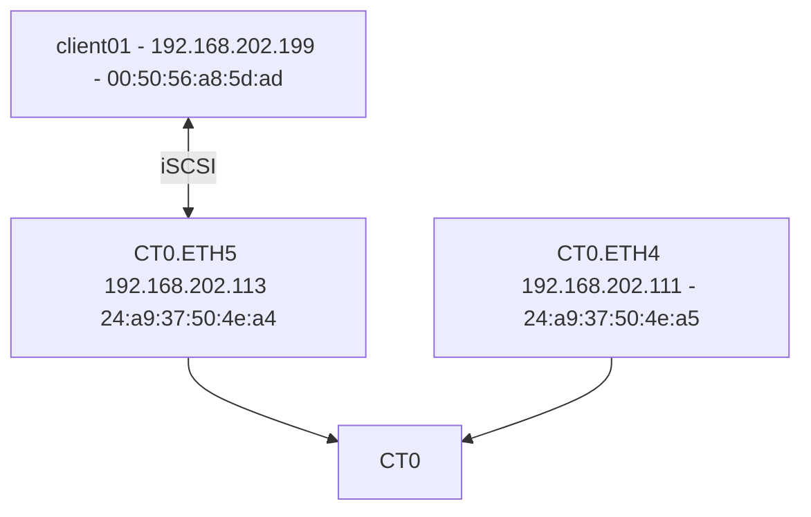

# Test1 - Local subnet iSCSI



Logs
```
eth4: flags=4163<UP,BROADCAST,RUNNING,MULTICAST>  mtu 1500
        inet 192.168.200.151  netmask 255.255.254.0  broadcast 192.168.201.255
        ether 24:a9:37:50:4e:a5  txqueuelen 1000  (Ethernet)
        RX packets 1964430  bytes 254558518 (254.5 MB)
        RX errors 0  dropped 0  overruns 0  frame 0
        TX packets 954340  bytes 284090753 (284.0 MB)
        TX errors 0  dropped 0 overruns 0  carrier 0  collisions 0
        device interrupt 73  memory 0xfb000000-fb01ffff  

eth5: flags=4163<UP,BROADCAST,RUNNING,MULTICAST>  mtu 1500
        inet 192.168.200.152  netmask 255.255.254.0  broadcast 192.168.201.255
        ether 24:a9:37:50:4e:a4  txqueuelen 1000  (Ethernet)
        RX packets 1799412  bytes 135719674 (135.7 MB)
        RX errors 0  dropped 0  overruns 0  frame 0
        TX packets 780065  bytes 135436628 (135.4 MB)
        TX errors 0  dropped 0 overruns 0  carrier 0  collisions 0
        device interrupt 64  memory 0xfb020000-fb03ffff

#dd if=/dev/zero of=/dev/sdb count=100 bs=1M


eth4: flags=4163<UP,BROADCAST,RUNNING,MULTICAST>  mtu 1500
        inet 192.168.200.151  netmask 255.255.254.0  broadcast 192.168.201.255
        ether 24:a9:37:50:4e:a5  txqueuelen 1000  (Ethernet)
        RX packets 1964747  bytes 254582081 (254.5 MB)
        RX errors 0  dropped 0  overruns 0  frame 0
        TX packets 954495  bytes 284119524 (284.1 MB)
        TX errors 0  dropped 0 overruns 0  carrier 0  collisions 0
        device interrupt 73  memory 0xfb000000-fb01ffff  

eth5: flags=4163<UP,BROADCAST,RUNNING,MULTICAST>  mtu 1500
        inet 192.168.200.152  netmask 255.255.254.0  broadcast 192.168.201.255
        ether 24:a9:37:50:4e:a4  txqueuelen 1000  (Ethernet)
        RX packets 1873976  bytes 246120087 (246.1 MB)
        RX errors 0  dropped 0  overruns 0  frame 0
        TX packets 783569  bytes 136802239 (136.8 MB)
        TX errors 0  dropped 0 overruns 0  carrier 0  collisions 0
        device interrupt 64  memory 0xfb020000-fb03ffff  

#dd if=/dev/sdb of=/dev/null count=100 bs=1M

eth4: flags=4163<UP,BROADCAST,RUNNING,MULTICAST>  mtu 1500
        inet 192.168.200.151  netmask 255.255.254.0  broadcast 192.168.201.255
        ether 24:a9:37:50:4e:a5  txqueuelen 1000  (Ethernet)
        RX packets 1965039  bytes 254602811 (254.6 MB)
        RX errors 0  dropped 0  overruns 0  frame 0
        TX packets 954632  bytes 284145043 (284.1 MB)
        TX errors 0  dropped 0 overruns 0  carrier 0  collisions 0
        device interrupt 73  memory 0xfb000000-fb01ffff  

eth5: flags=4163<UP,BROADCAST,RUNNING,MULTICAST>  mtu 1500
        inet 192.168.200.152  netmask 255.255.254.0  broadcast 192.168.201.255
        ether 24:a9:37:50:4e:a4  txqueuelen 1000  (Ethernet)
        RX packets 1880862  bytes 246631701 (246.6 MB)
        RX errors 0  dropped 0  overruns 0  frame 0
        TX packets 863808  bytes 258119749 (258.1 MB)
        TX errors 0  dropped 0 overruns 0  carrier 0  collisions 0
        device interrupt 64  memory 0xfb020000-fb03ffff  


# All Tests:

```
puresupport@MUCFA22-ct0:~$ purearray list --controller
Name  Type              Mode       Model     Version  Status  Current Mode Since        Internal Details
CT0   array_controller  primary    FA-X70R3  6.6.9    ready   2024-07-12 14:49:28 CEST  
CT1   array_controller  secondary  FA-X70R3  6.6.9    ready   2024-07-12 14:58:04 CEST
```
